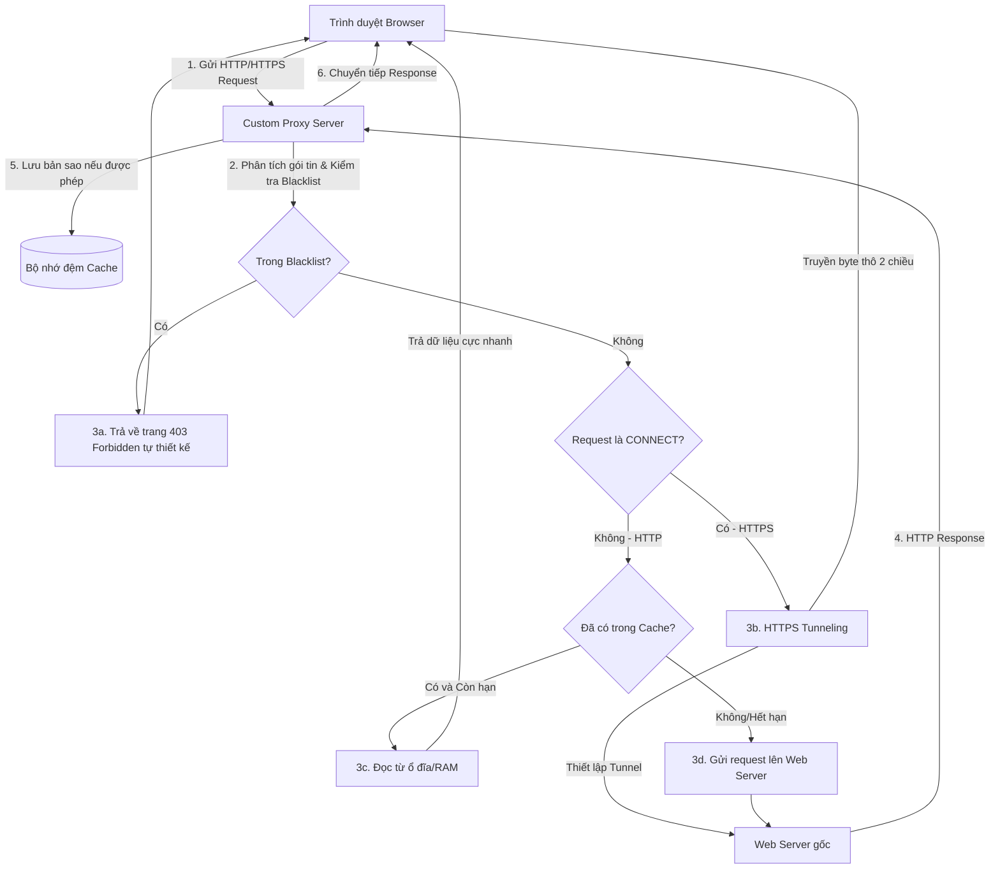

# Custom Web Proxy Server với Caching & Web Filter

Dự án phát triển một ứng dụng **Web Proxy Server trung gian** đứng giữa trình duyệt của người dùng (Browser) và Internet mạng lưới toàn cầu. Proxy đóng vai trò kiểm soát luồng dữ liệu, tăng tốc độ truy cập web thông qua cơ chế bộ nhớ đệm (Caching) thông minh và bảo vệ người dùng bằng hệ thống bộ lọc (Web Filtering/Ad Blocker).

Đây là đồ án thực hành môn **Mạng Máy Tính** giúp hiểu sâu sắc về kiến trúc HTTP/HTTPS, cách thức đóng gói gói tin, hoạt động đa luồng (Multi-threading), và cơ chế giao tiếp Socket ở tầng giao vận.

---

## 📌 Các Tính Năng Cốt Lõi

1. **Chuyển tiếp Request (HTTP Proxy):** Nhận yêu cầu HTTP (GET, POST...) từ client, phân tích cú pháp, chuyển tiếp đến server gốc, nhận phản hồi và gửi lại cho client.
2. **Đường ống bảo mật (HTTPS Tunneling):** Hỗ trợ phương thức `CONNECT` để thiết lập kết nối mã hóa SSL/TLS (HTTPS) thông qua cơ chế truyền byte thô hai chiều (Bi-directional Tunneling).
3. **Bộ nhớ đệm thông minh (Web Caching):**
   * Tự động phân tích các Header kiểm soát cache (`Cache-Control`, `Expires`).
   * Lưu các tài nguyên tĩnh (hình ảnh, CSS, JS, HTML) vào ổ đĩa cục bộ.
   * **Cơ chế xác thực (Revalidation):** Sử dụng cơ chế kiểm tra lại nguồn (Conditional GET) với `If-Modified-Since` hoặc `ETag` (trả về mã trạng thái HTTP `304 Not Modified` nếu tài nguyên không thay đổi), giúp giảm thiểu băng thông đáng kể.
   * **Giới hạn & Chính sách giải phóng bộ nhớ (Eviction Policy):** 
     * Quy định giới hạn dung lượng lưu trữ tối đa (ví dụ: tối đa `500MB`).
     * Áp dụng thuật toán **LRU (Least Recently Used)**: Tự động xóa các file cache ít được truy cập gần đây nhất khi bộ nhớ đệm đầy, kết hợp chính sách **TTL (Time-To-Live)** dựa trên thuộc tính `max-age` của header HTTP để dọn dẹp các file cache quá hạn.
4. **Bộ lọc tên miền (Web Filter & Ad Blocker):**
   * Chặn truy cập đối với danh sách đen tên miền (Blacklist) được định cấu hình trước. Trả về trang HTML cảnh báo (403 Forbidden) do nhóm tự thiết kế.
   * Lọc và chặn các request tải quảng cáo (từ các host quảng cáo phổ biến) trước khi trang web hiển thị trên trình duyệt.
5. **Trình giám sát lưu lượng (Real-time Dashboard - Tính năng nâng cao đạt điểm A+):**
   * Giao diện web chạy local hiển thị lịch sử truy cập (URL, Method, Status Code).
   * Biểu đồ trực quan tỷ lệ **Cache Hit** (dữ liệu lấy từ Cache) vs **Cache Miss** (dữ liệu lấy từ Internet).
   * Tổng dung lượng mạng đã tiết kiệm được nhờ cơ chế Caching.

---

## 🌐 Kiến Trúc Hoạt Động & Luồng Dữ Liệu

---

## 🎓 Kiến Thức Mạng Máy Tính & Giao Thức Khai Thác

Dự án này là cơ hội thực hành kinh điển giúp áp dụng và hiểu sâu sắc các kiến thức lý thuyết môn Mạng Máy Tính thông qua việc hiện thực hóa trực tiếp từ cấp độ lập trình Socket đến phân tích đặc tả giao thức tầng ứng dụng:

### 1. Ở Tầng Giao Vận (Transport Layer)
*   **Lập trình Socket TCP (TCP Socket Programming):**
    *   Hiện thực hóa mô hình kết nối tin cậy hướng dòng byte (Byte Stream-oriented).
    *   Vận hành cơ chế đa vai trò: Proxy hoạt động như một **TCP Server** (lắng nghe kết nối từ Browser) và đồng thời là **TCP Client** (khởi tạo kết nối bắt tay 3 bước `connect()` đến Web Server gốc).
*   **TCP Tunneling (Đường ống chuyển tiếp hai chiều):**
    *   Thiết lập luồng truyền byte thô song song hai chiều (`Browser <-> Proxy <-> Web Server`) khi nhận yêu cầu HTTPS với phương thức `CONNECT`. Minh họa trực quan khái niệm kênh truyền dẫn tin cậy đầu cuối (End-to-End).
*   **Xử lý bất đồng bộ & Đa luồng (Concurrency Control):**
    *   Sử dụng Threading/Async IO để xử lý song song hàng chục socket kết nối TCP đồng thời từ browser, giải quyết bài toán nghẽn luồng truyền dẫn TCP.

### 2. Ở Tầng Ứng Dụng (Application Layer)
*   **Hiện thực hóa Giao thức HTTP/1.1 (RFC 2616 & RFC 7230):**
    *   **Phân tích HTTP Request:** Tự code bóc tách thủ công dòng yêu cầu (Request Line) để lấy `Method`, `URI`, và phân tích các trường Header thiết yếu như `Host` (để định tuyến gói tin cấp ứng dụng), `Content-Length` (xác định kích thước dữ liệu truyền tải), `Connection: keep-alive` (quản lý thời gian sống của socket).
    *   **Xử lý HTTP Response:** Đọc trạng thái phản hồi (Status Code) và phân tích luồng dữ liệu phản hồi (Body) từ Web Server để chuyển tiếp về client.
*   **Cơ chế Web Caching (RFC 7234):**
    *   **Kiểm soát Cache:** Phân tích các header điều khiển cache từ server gốc như `Cache-Control` (`max-age`, `no-store`) để quyết định lưu trữ đệm.
    *   **Conditional GET (Xác thực lại bộ đệm):** Áp dụng cơ chế so khớp thời gian sửa đổi thông qua các Header `If-Modified-Since` (client gửi đi) và `Last-Modified` / `ETag` (server phản hồi) để nhận mã trạng thái `304 Not Modified`.
    *   **Chính sách quản lý bộ đệm (Eviction & Capacity Limits):**
        *   Hiện thực hóa cơ chế quản lý giới hạn dung lượng lưu trữ cục bộ (`500MB`) để tránh cạn kiệt tài nguyên đĩa cứng.
        *   Áp dụng thuật toán thay thế **LRU (Least Recently Used)** và cơ chế **TTL (Time-To-Live)** để tự động thu hồi không gian lưu trữ của các đối tượng cache đã cũ hoặc ít dùng nhất.
    *   *Ý nghĩa thực tế:* Tối ưu tài nguyên mạng thông qua giảm độ trễ phản hồi (**Latency Reduction**) và tiết kiệm băng thông đường truyền (**Bandwidth Saving**).
*   **Tường lửa tầng ứng dụng (Application-level Gateway):**
    *   Phân tích gói tin HTTP ở tầng 7 để so khớp tên miền Host với danh sách cấm (Blacklist) và lọc quảng cáo, thực thi vai trò của một thiết bị Firewall/IPS bảo mật mạng.

### 3. Giao thức Bảo mật & Mã hóa (SSL/TLS)
*   **HTTPS CONNECT Tunneling:**
    *   Do dữ liệu HTTPS được mã hóa đầu cuối bằng SSL/TLS, Proxy không thể can thiệp giải mã nội dung. Proxy khai thác phương thức `CONNECT` để chuyển tiếp luồng dữ liệu mã hóa thô an toàn mà không phá vỡ tính toàn vẹn và bí mật thông tin của giao thức bảo mật.

---

## 🛠️ Công Nghệ & Thư Viện Sử Dụng

Dự án được khuyến nghị xây dựng bằng ngôn ngữ **Python** (hoặc **Golang**) vì tính trực quan cao và sự hỗ trợ mạnh mẽ của thư viện lập trình mạng cấp thấp.

* **Lập trình Socket thô:** Sử dụng module `socket` tích hợp sẵn trong ngôn ngữ (không sử dụng các thư viện HTTP cấp cao như `requests`, `urllib` để đảm bảo tính học thuật).
* **Quản lý đa luồng (Concurrency):** Module `threading` hoặc thư viện lập trình bất đồng bộ `asyncio` để xử lý hàng chục kết nối song song từ trình duyệt.
* **Giao diện Dashboard (Tùy chọn nâng cao):** Sử dụng **Flask / FastAPI** kết hợp với HTML/CSS/Tailwind để xây dựng bảng điều khiển quản lý và xem log thời gian thực.
* **Công cụ kiểm thử & Debug:**
  * **Wireshark:** Để bắt và phân tích gói tin đối chứng.
  * **cURL / Postman:** Để test nhanh các request HTTP/HTTPS đi qua proxy.
  * Trình duyệt Chrome / Firefox cấu hình proxy thủ công (`Manual Proxy Setup` trỏ tới `127.0.0.1:[Port]`).

# BTL-MMT
