# Custom Web Proxy Server vá»›i Web Filter, Smart Caching, Traffic Shaping & Real-time Dashboard

Dự án này hiện thực hóa một **Custom Web Proxy Server** (máy chủ ủy nhiệm) trung gian, hoạt động tại tầng ứng dụng (Application Layer) giữa trình duyệt của ngư�i dùng (Browser/Client) và Internet. Proxy đóng vai trò như một bộ kiểm soát luồng dữ liệu, hỗ trợ tăng tốc độ truy cập thông qua cơ chế bộ nhớ đệm (Caching) thông minh, bảo vệ mạng LAN bằng hệ thống bộ l�c tên mi�n (Web Filtering/Ad Blocker), quản lý lưu lượng (Traffic Shaping/Failover) và cung cấp giao diện quản trị trực quan th�i gian thực (Dashboard).

�ây là đồ án thực hành môn **Mạng Máy Tính**, giúp củng cố và áp dụng trực tiếp các kiến thức lý thuyết v� kiến trúc HTTP/HTTPS, đóng gói dữ liệu, lập trình Socket TCP, đa luồng (Multi-threading), và các chuẩn RFC liên quan.

---

## 📌 Mục Lục
1. [Chi Tiết Các Chức Năng, Tác Dụng & Ứng Dụng](#-chi-tiết-các-chức-năng-tác-dụng--ứng-dụng)
2. [Kiến Trúc Hoạt �ộng & Luồng Dữ Liệu](#-kiến-trúc-hoạt-động--luồng-dữ-liệu)
3. [Cấu Trúc Mã Nguồn & Vai Trò Các Module](#-cấu-trúc-mã-nguồn--vai-trò-các-module)
4. [Hệ Thống Hóa Kiến Thức Mạng Máy Tính �p Dụng](#-hệ-thống-hóa-kiến-thức-mạng-máy-tính-áp-dụng)
5. [Hướng Dẫn Cài �ặt & Cấu Hình](#-hướng-dẫn-cài-đặt--cấu-hình)
6. [Kịch Bản Demo & Hướng Dẫn Kiểm Thử](#-kịch-bản-demo--hướng-dẫn-kiểm-thử)

---

## ⚙� Chi Tiết Các Chức Năng, Tác Dụng & Ứng Dụng

Dưới đây là bảng phân tích chi tiết 6 chức năng chính của hệ thống Proxy Server:

### 1. Chuyển Tiếp Yêu Cầu (HTTP Request Forwarding)
*   **Mô tả:** Nhận yêu cầu HTTP (GET, POST, HEAD,...) từ client, phân tích gói tin, kết nối và gửi yêu cầu tới web server gốc, nhận phản hồi và trả v� cho client.
*   **Cơ chế hoạt động:**
    1. Lắng nghe và chấp nhận kết nối TCP từ client.
    2. ��c luồng byte thô gửi từ trình duyệt, tách dòng đầu tiên (Request Line) để lấy `Method`, `URL`, và `HTTP Version`. Tách các trư�ng Header thành dạng cặp Key-Value.
    3. Chuyển đổi URL từ dạng tuyệt đối (Absolute URL - do trình duyệt gửi qua proxy, ví dụ: `http://example.com/index.html`) sang dạng tương đối (Relative URL, ví dụ: `/index.html`) để gửi tới server gốc theo chuẩn HTTP/1.1.
    4. Thêm/sửa header `Connection: close` để yêu cầu server đóng kết nối ngay khi hoàn thành gửi response, giúp Proxy nhận diện điểm kết thúc của luồng dữ liệu mà không bị treo socket.
    5. ��c response từ server gốc một cách tối ưu: đ�c phần header trước để tìm trư�ng `Content-Length`. Nếu có `Content-Length`, Proxy sẽ đ�c chính xác số byte dữ liệu còn lại. Nếu không có, Proxy sẽ đ�c liên tục cho đến khi server ngắt kết nối (hoặc timeout).
*   **Tác dụng:** Làm cầu nối trung gian đại diện cho client, giúp che giấu địa chỉ IP thật của client trước các máy chủ trên Internet (đảm bảo tính riêng tư ở mức cơ bản).
*   **Ứng dụng thực tế:** �ược ứng dụng làm Forward Proxy trong mạng nội bộ của doanh nghiệp, giúp định tuyến tập trung lưu lượng truy cập web của toàn bộ nhân viên ra ngoài Internet.

### 2. �ư�ng �ng Bảo Mật (HTTPS CONNECT Tunneling)
*   **Mô tả:** Hỗ trợ thiết lập đư�ng truy�n mã hóa SSL/TLS an toàn giữa client và web server đích bằng phương thức `CONNECT`.
*   **Cơ chế hoạt động:**
    1. Khi trình duyệt muốn truy cập một trang web HTTPS (ví dụ: `https://google.com`), nó gửi yêu cầu có dạng: `CONNECT google.com:443 HTTP/1.1`.
    2. Proxy nhận request này, trích xuất hostname và port (`google.com`, `443`), sau đó thiết lập kết nối TCP trực tiếp đến server gốc.
    3. Nếu kết nối thành công, Proxy trả lại trình duyệt thông điệp: `HTTP/1.1 200 Connection Established\r\n\r\n`.
    4. Kể từ th�i điểm này, Proxy chuyển hai socket (client socket và server socket) sang chế độ phi chặn (non-blocking) và sử dụng hàm `select.select()` để giám sát sự kiện có dữ liệu. M�i dữ liệu đi qua Proxy chỉ được chuyển tiếp nguyên bản dưới dạng byte thô song hướng mà không h� bị giải mã hay đ�c nội dung (End-to-End Encryption).
*   **Tác dụng:** Cho phép ngư�i dùng truy cập an toàn vào các trang web HTTPS bảo mật cao (như ngân hàng, thương mại điện tử, mạng xã hội) mà vẫn đi qua được Proxy Server mà không làm suy yếu hoặc phá vỡ tính bảo mật của giao thức mã hóa SSL/TLS.
*   **Ứng dụng thực tế:** Hầu hết các proxy doanh nghiệp đ�u sử dụng cơ chế này để cho phép nhân viên duyệt web an toàn mà không xâm phạm vào dữ liệu cá nhân nhạy cảm đã mã hóa của h�.

### 3. Bộ Nhớ �ệm Thông Minh (Smart Web Caching)
*   **Mô tả:** Lưu trữ tạm th�i các tài nguyên tĩnh (hình ảnh, CSS, JS, HTML) trên ổ đĩa local của Proxy để phục vụ ngay cho các yêu cầu kế tiếp, giảm tải đư�ng truy�n Internet.
*   **Cơ chế hoạt động:**
    *   **Phân tích Header đi�u khiển:** Khi nhận response từ server gốc, Proxy phân tích trư�ng `Cache-Control`. Nếu chứa `no-store` hoặc `private`, Proxy sẽ không cache tài nguyên đó. Nếu có chỉ định `max-age=N`, th�i gian sống (TTL) của cache sẽ là `N` giây; ngược lại, Proxy sử dụng cấu hình mặc định (ví dụ: 1 gi�).
    *   **Cấu trúc lưu trữ:** Tài nguyên được lưu trữ tại thư mục `cache/` gồm 2 file cho mỗi URL: `{md5_hash}.data` (chứa phần Body của Response) và `{md5_hash}.meta` (chứa metadata dạng JSON bao gồm URL, th�i gian tạo, headers gốc, TTL, kích thước, Last-Modified, ETag).
    *   **Xác thực lại bộ đệm (Conditional GET / Revalidation):** Khi cache hết hạn (TTL quá hạn), Proxy không tải lại từ đầu mà gửi một yêu cầu có đi�u kiện (Conditional GET) kèm header `If-Modified-Since` (nếu có `Last-Modified` trong cache) hoặc `If-None-Match` (nếu có `ETag`). Nếu server phản hồi mã trạng thái `304 Not Modified`, Proxy lập tức cập nhật lại TTL (Refresh TTL) và trả dữ liệu cũ trong cache cho trình duyệt.
    *   **Chính sách giải phóng bộ nhớ (Eviction Policy):** Khi tổng dung lượng thư mục cache vượt quá cấu hình tối đa (`config.MAX_CACHE_SIZE`, mặc định 500MB), Proxy áp dụng thuật toán **LRU (Least Recently Used)**: sắp xếp các file cache theo th�i gian truy cập gần nhất (`last_accessed`), tiến hành xóa các file ít được truy cập nhất cho đến khi dung lượng cache giảm xuống dưới 90% giới hạn.
*   **Tác dụng:**
    *   **Giảm độ trễ (Latency Reduction):** Tải trang cực nhanh đối với các tài nguyên đã được lưu trữ cục bộ.
    *   **Tiết kiệm băng thông (Bandwidth Saving):** Giảm dung lượng dữ liệu phải tải từ Internet v� mạng LAN.
    *   **Giảm tải cho server gốc:** Không cần xử lý lại các request cho tài nguyên tĩnh không thay đổi.
*   **Ứng dụng thực tế:** Là hạt nhân công nghệ của các mạng phân phối nội dung (CDN - Content Delivery Network) lớn như Cloudflare, Akamai và các hệ thống Proxy tăng tốc mạng của nhà mạng ISP hoặc tập đoàn lớn.

### 4. Tư�ng Lửa Tầng Ứng Dụng (Web Filtering & Ad Blocker)
*   **Mô tả:** Kiểm soát và ngăn chặn quy�n truy cập đối với các tên mi�n cấm (Blacklist) hoặc chặn các liên kết tải quảng cáo, mã theo dõi (Ad Blocker) trước khi hiển thị ra trình duyệt.
*   **Cơ chế hoạt động:**
    1. Khi nhận request, Proxy bóc tách tên mi�n (`hostname`) từ URL hoặc từ header `Host`.
    2. So khớp domain này với danh sách đen đã nạp trong RAM (`blacklist.txt` và `adlist.txt`).
    3. **Subdomain Matching:** Hệ thống khớp phân cấp thông minh. Ví dụ, nếu chặn `facebook.com` thì tự động chặn cả `m.facebook.com`, `api.facebook.com`... nhưng nếu chỉ chặn `m.facebook.com` thì ngư�i dùng vẫn truy cập được `facebook.com` bình thư�ng.
    4. **Trả v� trang 403 tùy chỉnh:** Nếu tên mi�n bị chặn, Proxy không gửi request ra Internet mà lập tức trả v� cho client mã trạng thái `403 Forbidden` kèm một trang HTML thông báo lỗi được thiết kế trực quan chuyên nghiệp (`templates/blocked.html`), giải thích rõ lý do bị chặn.
    5. **Hot-reload:** Hỗ trợ đ�c và cập nhật lại danh sách chặn ngay khi server đang chạy thông qua một API trên giao diện Dashboard mà không cần khởi động lại toàn bộ Proxy.
*   **Tác dụng:** Ngăn chặn truy cập vào các trang web độc hại (phishing, malware), quản lý hiệu suất làm việc (chặn mạng xã hội, game trong gi� hành chính), loại b� các quảng cáo phi�n toái giúp trang web hiển thị sạch và nhanh hơn.
*   **Ứng dụng thực tế:** Mô hình giống như các thiết bị tư�ng lửa thế hệ mới (NGFW), các phần m�m Parental Control (quản lý con cái), hoặc hệ thống chặn quảng cáo toàn mạng LAN như **Pi-hole**.

### 5. Bảng �i�u Khiển Trực Quan (Real-time Dashboard)
*   **Mô tả:** Giao diện web chạy tại địa chỉ local (`http://localhost:5000`) hiển thị trực quan các số liệu thống kê lưu lượng mạng, nhật ký truy cập và cho phép cấu hình Proxy th�i gian thực.
*   **Cơ chế hoạt động:**
    1. Proxy khởi tạo một luồng chạy song song (background thread) chứa một ứng dụng web Flask.
    2. Flask app định nghĩa các API để đ�c thông tin th�i gian thực từ các module `ProxyLogger`, `CacheManager` và `WebFilter`.
    3. Dashboard HTML sử dụng CSS hiện đại (sleek dark mode, glassmorphism) kết hợp thư viện **Chart.js** để vẽ biểu đồ tròn tỷ lệ Cache Hit/Miss, biểu đồ cột các HTTP Method được sử dụng nhi�u nhất, và danh sách xếp hạng Top 10 domain được truy cập.
    4. Giao diện tự động cập nhật dữ liệu (auto-refresh) mỗi 3 giây thông qua các cuộc g�i API Ajax không tải lại trang.
*   **Tác dụng:** Giúp ngư�i quản trị mạng có cái nhìn tổng quan, trực quan sinh động v� toàn bộ lưu lượng mạng, dễ dàng phát hiện ra các bất thư�ng hoặc thiết bị chiếm dụng nhi�u băng thông mà không phải đ�c các dòng log terminal phức tạp.
*   **Ứng dụng thực tế:** Tương tự giao diện quản trị của các router chuyên dụng, các hệ thống giám sát mạng (PRTG, Grafana) trong doanh nghiệp.

### 6. Giới Hạn Băng Thông & Dự Phòng Mạng (Traffic Shaping & Failover)
*   **Mô tả:** Giới hạn tốc độ download dữ liệu cho các kết nối client và tự động chuyển hướng đư�ng truy�n khi card mạng chính gặp sự cố kết nối.
*   **Cơ chế hoạt động:**
    *   **Traffic Shaping:** Khi gửi dữ liệu phản hồi v� client qua socket, Proxy chia dữ liệu thành các chunk nh� (ví dụ: 4KB). Dựa trên giới hạn băng thông được cấu hình (ví dụ: 50KB/s), Proxy tính toán th�i gian cần thiết để gửi mỗi chunk và thực hiện hàm sleep (`time.sleep`) tương ứng để kéo dài th�i gian truy�n tải, giữ tốc độ trung bình đúng ngưỡng quy định.
    *   **Multi-interface Routing & Failover:** Cấu hình danh sách các card mạng (outgoing interfaces) trong `config.py`. Khi kết nối tới server gốc, Proxy thử kết nối lần lượt qua từng interface. Nếu xảy ra lỗi kết nối, Proxy tự động thử giao diện tiếp theo trong danh sách. Trên Dashboard cung cấp nút bấm giả lập lỗi card mạng chính (`SIMULATE_FAILOVER = True`) để trình diễn cơ chế tự động chuyển hướng qua card mạng dự phòng ngay lập tức mà không làm đứt kết nối của ngư�i dùng.
*   **Tác dụng:** �ảm bảo tính công bằng trong chia sẻ băng thông mạng (Quality of Service - QoS), tránh nghẽn mạng do một ngư�i dùng download file dung lượng lớn. Nâng cao độ tin cậy và tính sẵn sàng của hệ thống mạng (High Availability).
*   **Ứng dụng thực tế:** �ược sử dụng trên các thiết bị định tuyến cân bằng tải (Load Balancer), thiết bị quản lý băng thông chuyên dụng hoặc hệ thống mạng doanh nghiệp đa đư�ng truy�n (FTTH + Leased Line + 4G/5G Backup).

---

## � Kiến Trúc Hoạt �ộng & Luồng Dữ Liệu

Dưới đây là sơ đồ chi tiết biểu diễn luồng đi của gói tin từ khi Trình duyệt (Browser) gửi yêu cầu cho đến khi nhận được phản hồi thông qua Custom Web Proxy Server:



### Chi tiết luồng xử lý:
1.  **Lắng nghe kết nối:** Proxy luôn lắng nghe trên cổng `8888`. Khi có kết nối TCP đến, nó tạo ra một luồng xử lý độc lập (`Thread`) để quản lý kết nối đó, giúp server phục vụ đồng th�i nhi�u trình duyệt khác nhau.
2.  **Bóc tách gói tin (Parsing):** Proxy đ�c dữ liệu từ socket, phân tích dòng đầu tiên để xác định URL và phương thức gửi yêu cầu.
3.  **L�c tên mi�n:** Nếu domain nằm trong danh sách cấm, Proxy ngắt kết nối với Internet, sinh ra gói tin phản hồi HTTP 403 gửi v� trình duyệt và ghi log `BLOCKED`.
4.  **Tạo đư�ng ống HTTPS (CONNECT):** Nếu là request HTTPS, Proxy kết nối đến cổng 443 của server đích, gửi mã phản hồi 200 OK v� client, sau đó lập tức thiết lập đư�ng ống chuyển tiếp dữ liệu thô.
5.  **Quản lý bộ nhớ đệm (Caching):**
    *   Nếu là request HTTP thư�ng, Proxy băm URL thành mã MD5 và đối chiếu với các file `{md5}.meta` trong thư mục cache.
    *   Nếu cache còn hạn (TTL chưa hết), Proxy đ�c nội dung file `{md5}.data` và gửi thẳng v� client (Cache Hit).
    *   Nếu cache hết hạn, Proxy thực hiện gửi request kèm header kiểm tra `If-Modified-Since` đến server gốc. Nếu nhận được `304 Not Modified` từ server gốc, Proxy lấy lại dữ liệu cũ từ cache để trả v� client và cập nhật lại th�i gian sống mới.
    *   Nếu là cache mới (hoặc server trả v� `200 OK` mới), Proxy sẽ ghi đè dữ liệu mới vào file cache local và áp dụng chính sách giải phóng bộ nhớ LRU nếu dung lượng đĩa đầy.
6.  **Kiểm soát băng thông (Traffic Shaping):** Trước khi dữ liệu cuối cùng đến tay trình duyệt, nó được đi qua bộ đi�u phối tốc độ, làm trễ luồng gửi để đảm bảo tốc độ download không vượt ngưỡng thiết lập.

---

## � Cấu Trúc Mã Nguồn & Vai Trò Các Module

Mã nguồn dự án được tổ chức theo kiến trúc module hóa rõ ràng, phân chia nhiệm vụ cụ thể cho từng thành phần:

```
BTL-MMT/
├── proxy.py              # Chương trình chính (Main Entry Point), xử lý Socket TCP và đi�u phối kết nối
├── config.py             # Tập trung toàn bộ hằng số cấu hình hệ thống (Port, Cache size, Timeouts...)
├── cache_manager.py      # Quản lý hoạt động đ�c/ghi Cache, kiểm tra TTL, thực hiện thuật toán LRU Eviction
├── web_filter.py         # Xử lý kiểm tra blacklist/adlist, subdomain matching và tạo trang 403 Forbidden
├── logger.py             # Ghi nhật ký hoạt động mạng ra file logs/proxy.log và tính toán số liệu thống kê
├── dashboard.py          # Khởi động Flask ### 2. Cấu Hình Hệ Thống (`config.py`)
Mở file `config.py` để thay đổi các tham số hoạt động chính của Proxy:
*   `PROXY_PORT`: Cổng Proxy lắng nghe (Mặc định: `8888`).
*   `MAX_CACHE_SIZE`: Giới hạn bộ nhớ đệm tối đa (Mặc định: `500MB`).
*   `CACHE_DEFAULT_TTL`: Th�i gian sống mặc định của cache nếu server không chỉ định (Mặc định: `3600` giây).
*   `BANDWIDTH_LIMIT`: Tốc độ giới hạn tải xuống (Mặc định: `0` - Không giới hạn). Có thể chỉnh sang các mức khác như `51200` (50 KB/s) để test.
*   `SIMULATE_WEBSITE_OUTAGE`: Bật/tắt giả lập lỗi máy chủ gốc ngoại tuyến để demo bộ nhớ đệm offline.

---

## � Kịch Bản Demo & Hướng Dẫn Kiểm Thử

�ể trình diễn đồ án một cách ấn tượng trước hội đồng giám khảo, bạn hãy thực hiện theo kịch bản sau:

### Bước 1: Khởi động hệ thống
Mở Terminal/CMD tại thư mục dự án và chạy:
```bash
python proxy.py
```
Hệ thống sẽ hiển thị giao diện chào mừng, các thông tin cổng lắng nghe, số lượng domain bị chặn, thư mục cache và liên kết truy cập Dashboard.

### Bước 2: Cấu hình Proxy trên trình duyệt Chrome hoặc Firefox
*   Mở trình duyệt của bạn (Chrome, Edge hoặc Firefox).
*   Cài đặt Proxy thủ công tr� v� địa chỉ IP `127.0.0.1` và Port `8888`.
*   *(Khuyên dùng)* Sử dụng tab ẩn danh (Incognito) để tránh trình duyệt tự động chuyển hướng cache.

### Bước 3: Demo các tính năng thực tế

#### Kịch bản 1: Duyệt web HTTP thư�ng & Kiểm tra Cache
1.  Truy cập trang web HTTP thư�ng (Ví dụ: `http://example.com` - gõ rõ `http://`).
2.  Trang hiển thị bình thư�ng. Trên terminal của Proxy sẽ in ra log `� CACHE MISS` (lần đầu tiên truy cập).
3.  Tải lại trang (`F5` hoặc nhấn Enter thanh địa chỉ).
4.  Trang tải tức thì. Trên terminal in ra log `💾 CACHE HIT` và trên Dashboard tỷ lệ Cache Hit Rate tăng lên.

#### Kịch bản 2: Kiểm tra HTTPS CONNECT Tunneling
1.  Truy cập một trang web mã hóa HTTPS (Ví dụ: `https://google.com` hoặc `https://github.com`).
2.  Trang hiển thị an toàn. Trên terminal in ra log `🔒 TUNNEL` kết nối đến cổng 443. Dữ liệu được truy�n tải bảo mật tuyệt đối.

#### Kịch bản 3: Kiểm tra Web Filter & Chặn quảng cáo
1.  Truy cập một trang web trong blacklist (Ví dụ: `http://facebook.com` hoặc `http://tiktok.com`).
2.  Trình duyệt lập tức hiển thị trang cảnh báo **403 Forbidden** do nhóm tự thiết kế. Terminal in ra log `⛔ BLOCKED`.

#### Kịch bản 4: Kiểm tra Xác thực ngư�i dùng (Captive Portal)
1.  Trên Dashboard (`http://localhost:5000`), bật toggle **"Bật Xác Thực �ăng Nhập"**.
2.  Mở tab mới trên trình duyệt proxy, truy cập `http://neverssl.com`.
3.  Trình duyệt sẽ tự động chuyển hướng hiển thị trang đăng nhập Captive Portal màu tím bảo mật của bạn.
4.  Nhập tài khoản `admin` / mật khẩu `proxy123` để đăng nhập thành công và truy cập Internet.

#### Kịch bản 5: Giả lập sập trang web & Offline Cache Fallback
1.  �ảm bảo bạn đã từng truy cập và cache trang `http://example.com`.
2.  Trên Dashboard, kích hoạt **"Giả Lập Ngoại Tuyến (Offline)"**.
3.  Tải lại trang `http://example.com`. Trang web vẫn sẽ hiển thị bình thư�ng (tải từ cache) kèm theo một **banner màu vàng cam cảnh báo lỗi máy chủ gốc** hiển thị ở trên cùng.
4.  Truy cập một trang chưa từng vào (chưa cache) $\rightarrow$ hiển thị trang lỗi **502 Web Server Offline** màu đ�.
£o mật thông tin.
*   **Conditional GET:** Hiểu rõ cơ chế xác thực dữ liệu đệm bằng cách sử dụng các cặp header `If-Modified-Since` đi kèm `Last-Modified`, và `If-None-Match` đi kèm `ETag`. �ây là cơ chế giảm thiểu tài nguyên mạng cốt lõi của Internet.
*   **Thuật toán LRU (Least Recently Used):** Ứng dụng cấu trúc dữ liệu và giải thuật trong quản lý tài nguyên phần cứng, tự động thu hồi không gian bộ đệm khi chạm ngưỡng giới hạn.

### 4. Tư�ng Lửa Tầng Ứng Dụng (Application Gateway)
*   Proxy hoạt động ở tầng cao nhất (Layer 7 trong mô hình OSI), do đó nó có khả năng phân tích nội dung gói tin (chỉ với HTTP thư�ng) để ra quyết định l�c theo tên mi�n chủ đích, thay vì chỉ l�c theo địa chỉ IP thô ở Layer 3/4 của các Router thông thư�ng.

---

## 🛠� Hướng Dẫn Cài �ặt & Cấu Hình

### 1. Chuẩn Bị Môi Trư�ng
Dự án được viết hoàn toàn bằng **Python 3** và chỉ sử dụng thư viện tích hợp sẵn (`socket`, `threading`, `json`...) ngoại trừ **Flask** dùng cho Dashboard.

Cài đặt Flask bằng lệnh:
```bash
pip install flask
```

### 2. Cấu Hình Hệ Thống (`config.py`)
Mở file `config.py` để thay đổi các tham số hoạt động chính của Proxy:
*   `PROXY_PORT`: Cổng Proxy lắng nghe (Mặc định: `8888`).
*   `MAX_CACHE_SIZE`: Giới hạn bộ nhớ đệm tối đa (Mặc định: `500MB`).
*   `CACHE_DEFAULT_TTL`: Th�i gian sống mặc định của cache nếu server không chỉ định (Mặc định: `3600` giây).
*   `BANDWIDTH_LIMIT`: Tốc độ giới hạn tải xuống (Mặc định: `0` - Không giới hạn). Có thể chỉnh sang các mức khác như `51200` (50 KB/s) để test.
*   `OUTGOING_INTERFACES`: Danh sách các card mạng dùng cho việc định tuyến và demo cơ chế Failover.

---

## � Kịch Bản Demo & Hướng Dẫn Kiểm Thử

�ể trình diễn đồ án một cách ấn tượng trước hội đồng giám khảo, bạn hãy thực hiện theo kịch bản sau:

### Bước 1: Khởi động hệ thống
Mở Terminal/CMD tại thư mục dự án và chạy:
```bash
python proxy.py
```
Hệ thống sẽ hiển thị giao diện chào mừng, các thông tin cổng lắng nghe, số lượng domain bị chặn, thư mục cache và liên kết truy cập Dashboard.

### Bước 2: Cấu hình Proxy trên trình duyệt Firefox
*   Mở Firefox → Vào **Settings** (Cài đặt) → Tìm kiếm từ khóa `proxy`.
*   Ch�n **Settings...** ở mục Network Settings.
*   Ch�n **Manual proxy configuration** (Cấu hình proxy thủ công).
*   Nhập HTTP Proxy: `127.0.0.1`, Port: `8888`.
*   Tích ch�n: **Also use this proxy for HTTPS** (Sử dụng cả cho HTTPS).
*   Nhấn **OK**.

### Bước 3: Demo các tính năng thực tế

#### Kịch bản 1: Duyệt web HTTP thư�ng & Kiểm tra Cache
1.  Trên Firefox, truy cập trang web HTTP thư�ng (Ví dụ: `http://example.com`).
2.  Trang web hiển thị bình thư�ng. Trên terminal của Proxy sẽ in ra log `� CACHE MISS` (lần đầu tiên truy cập).
3.  Tải lại trang (`F5` hoặc nhấn Enter thanh địa chỉ).
4.  Trang tải tức thì. Trên terminal in ra log `💾 CACHE HIT` và trên Dashboard tỷ lệ Cache Hit Rate tăng lên.

#### Kịch bản 2: Kiểm tra HTTPS Tunneling
1.  Truy cập một trang web mã hóa HTTPS (Ví dụ: `https://google.com` hoặc `https://github.com`).
2.  Trang web hiển thị an toàn. Trên terminal in ra log `🔒 TUNNEL` kết nối đến cổng 443. Dữ liệu được truy�n tải bảo mật tuyệt đối.

#### Kịch bản 3: Kiểm tra Web Filter & Chặn quảng cáo
1.  Truy cập một trang web trong blacklist (Ví dụ: `http://facebook.com` hoặc `http://tiktok.com`).
2.  Trình duyệt lập tức hiển thị trang cảnh báo **403 Forbidden** do nhóm tự thiết kế với thông điệp *"Truy cập bị chặn bởi hệ thống proxy"*.
3.  Terminal in ra log `â›” BLOCKED`.

#### Kịch bản 4: Giám sát qua Dashboard & Thay đổi cấu hình
1.  Mở một tab mới trên trình duyệt bất kỳ, truy cập: `http://localhost:5000`.
2.  Quan sát các biểu đồ trực quan, danh sách lịch sử request cập nhật th�i gian thực sau mỗi 3 giây.
3.  Thử ch�n **Giới hạn băng thông** (ví dụ: `50 KB/s`).
4.  Quay lại Firefox, truy cập một trang web mới, bạn sẽ thấy tốc độ tải trang chậm lại rõ rệt do tính năng Traffic Shaping đang hoạt động.
5.  Thử bật **Failover Simulation** để xem cơ chế chuyển card mạng tự động khi giao diện chính bị lỗi kết nối.
